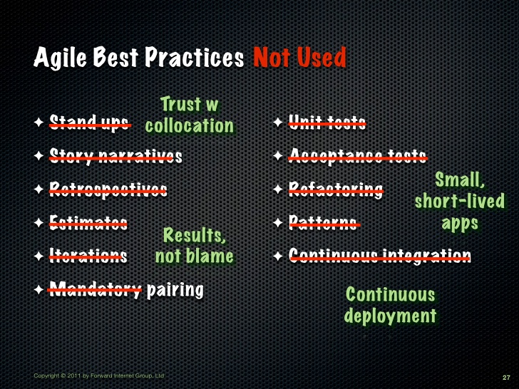
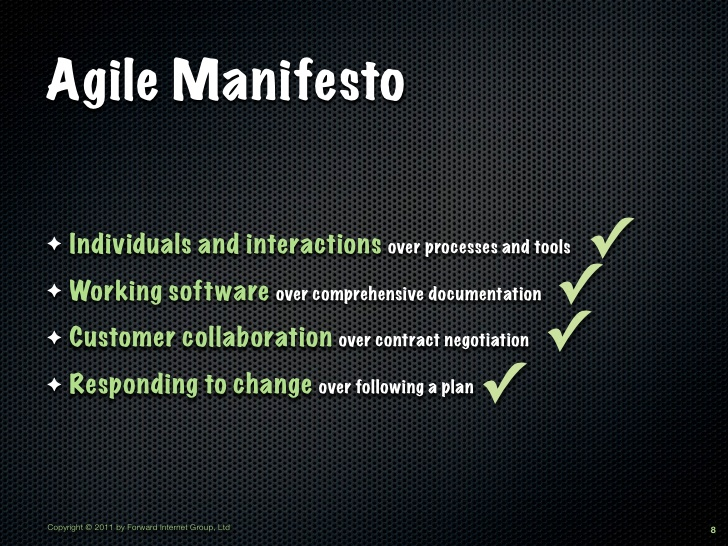
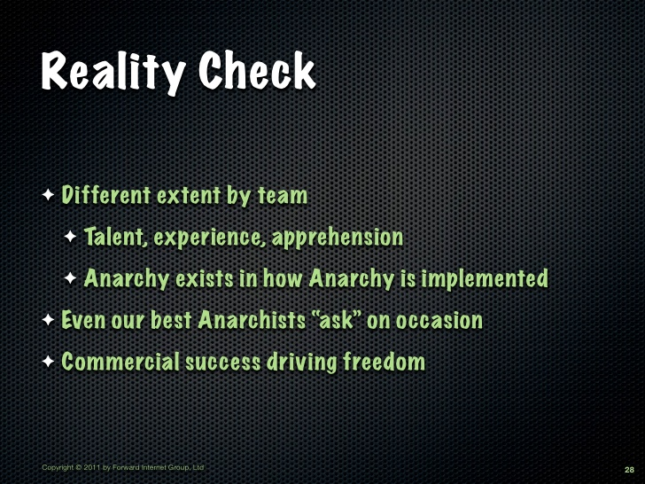
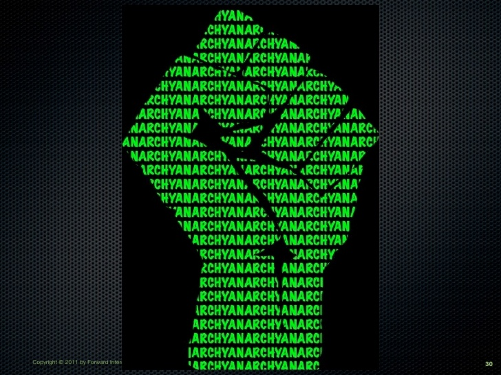

# Programmer Anarchy

Programmer Anarchy is an approach to software development promoted by [Fred George](https://twitter.com/fgeorge52).

Watch and learn:
  - [Programmer Anarchy, Presented on YouTube](https://www.youtube.com/watch?v=uk-CF7klLdA)
  - [Slides](http://www.slideshare.net/fredgeorge/programmer-anarchy-chinese)

Read about it:
  - [What is Programmer Anarchy and does it have a future?](http://martinjeeblog.com/2012/11/20/what-is-programmer-anarchy-and-does-it-have-a-future/)

--
## tl;dw / tl;dr

**KEEP IT SIMPLE STUPID**

**AND YET, IT IS AGILE**

